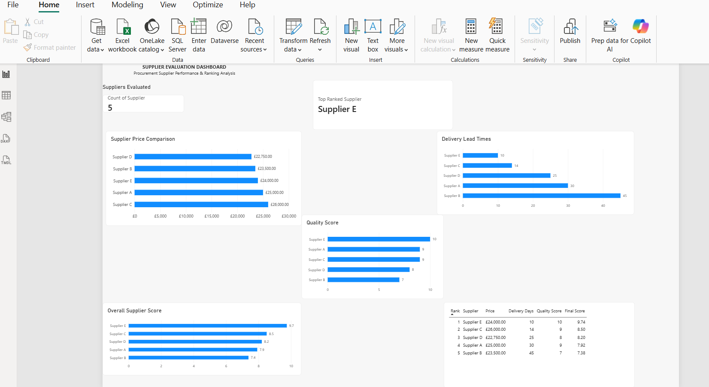

# Supplier Evaluation & Procurement Analytics

## Project Overview

This project is a supplier evaluation and procurement analytics tool developed using Python, Pandas, CSV data processing, and Microsoft Power BI.

The project demonstrates how supplier information can be processed and evaluated using predefined procurement criteria to support structured supplier comparison and management reporting.

## Business Problem

Procurement teams often need to evaluate suppliers across multiple factors rather than simply selecting the supplier offering the lowest price.

Important considerations can include:

- Price
- Delivery lead time
- Quality
- Supplier performance

Manually comparing suppliers can become time-consuming as the number of quotations increases.

## Solution

This project uses Python to:

1. Import supplier data from a CSV file.
2. Analyse supplier pricing.
3. Evaluate delivery lead times.
4. Incorporate supplier quality scores.
5. Apply weighted evaluation criteria.
6. Calculate an overall supplier score.
7. Rank suppliers automatically.
8. Export the results for analysis in Power BI.

## Evaluation Model

The current model uses the following weighting:

- Price: 50%
- Delivery: 20%
- Quality: 30%

The weighting can be modified in the Python script depending on procurement requirements.

## Technologies Used

- Python
- Pandas
- CSV
- Microsoft Power BI
- Visual Studio Code
- GitHub

## Project Structure

supplier_ranking.py  
suppliers.csv  
supplier_results.csv  
Supplier_Evaluation_Dashboard.pbix

## Dashboard

The Power BI dashboard provides:

- Number of suppliers evaluated
- Top-ranked supplier
- Supplier price comparison
- Delivery lead-time comparison
- Quality comparison
- Overall supplier scores
- Supplier ranking table

## Skills Demonstrated

- Python programming
- Data analysis with Pandas
- Data cleaning and transformation
- Procurement analytics
- Supplier evaluation
- Weighted scoring models
- Data visualisation
- Power BI dashboard development

## Future Development

The project can be extended to include:

- Automatic extraction of supplier quotation data from PDF documents
- AI-assisted quotation analysis
- Automated email processing
- Supplier risk assessment
- Database integration
- Workflow automation using Make
- AI/API integration

## Disclaimer

This project is a learning and portfolio project. The supplier data is illustrative, and the scoring methodology should be adapted to an organisation's procurement policies before use in real procurement decisions.
